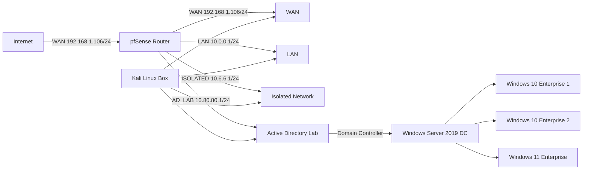

## Here is a basic map of my current home lab

```mermaid
graph LR
    A["Internet"] -->|"WAN 192.168.1.106/24"| B["pfSense Router"]

    B -->|"WAN 192.168.1.106/24"| C["WAN"]
    B -->|"LAN 10.0.0.1/24"| D["LAN"]
    B -->|"ISOLATED 10.6.6.1/24"| E["Isolated Network"]
    B -->|"AD_LAB 10.80.80.1/24"| F["Active Directory Lab"]

    F -->|"Domain Controller"| G["Windows Server 2019 DC"]
    G --> H["Windows 10 Enterprise 1"]
    G --> I["Windows 10 Enterprise 2"]
    G --> J["Windows 11 Enterprise"]
    
    K["Kali Linux Box"] --> C
    K --> D
    K --> E
    K --> F
```
