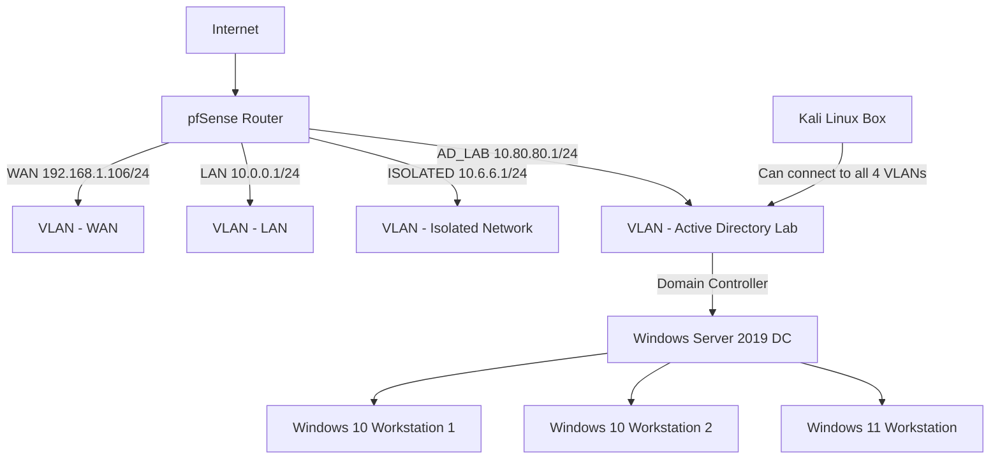

## Here is a basic map of my current home lab

My lab currently consists of a virtualized pfsense router with four VLANs. I currently have an Active Directory lab set up with a Domain Controller running Windows Server 2019, two Windows 10 workstations, and one Windows 11 workstation. 

The Isolated VLAN has been set up for playing with intentionally vulnerable VMs, such as OWASP Juice Shop, machines from VulnHub, etc.

I am currently not using the other VLANs for anything, but wanted to practice setting up pfsense and building a network.

I am working on writing posts for some basic AD attacks and will hopefully start posting those here soon!